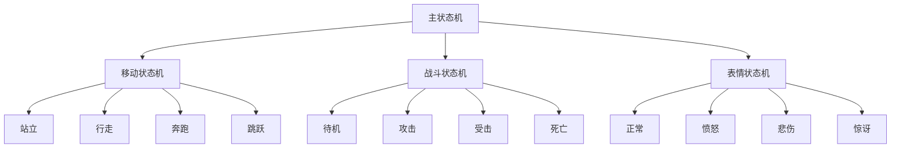
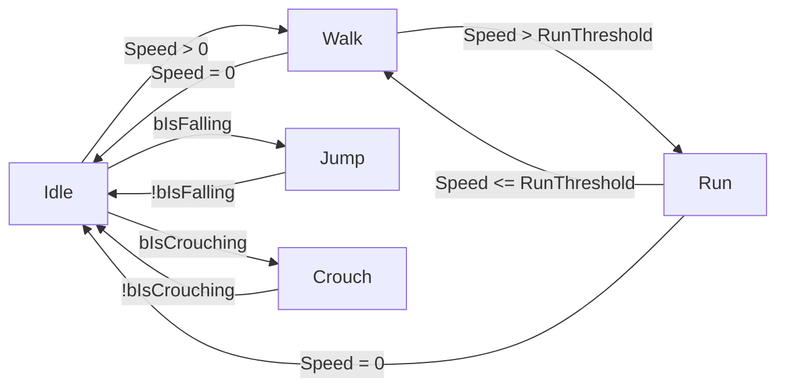
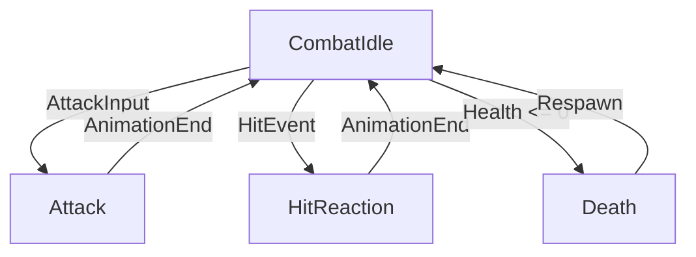

# 第四章：动画蓝图与状态机

## 4.1 AnimInstance架构详解

### 4.1.1 AnimInstance类层次结构

```cpp
// AnimInstance的类继承关系
UCLASS()
class ENGINE_API UAnimInstance : public UObject
{
    GENERATED_BODY()
    
public:
    // 核心更新函数
    virtual void NativeInitializeAnimation();
    virtual void NativeUpdateAnimation(float DeltaSeconds);
    virtual void NativeThreadSafeUpdateAnimation(float DeltaSeconds);
    virtual void NativePostEvaluateAnimation();
    
    // 蓝图可重写函数
    UFUNCTION(BlueprintNativeEvent, Category = "Animation")
    void BlueprintInitializeAnimation();
    
    UFUNCTION(BlueprintNativeEvent, Category = "Animation")
    void BlueprintUpdateAnimation(float DeltaTime);
};
```

### 4.1.2 动画实例的生命周期

**初始化阶段**：
1. **构造阶段**：对象创建，变量初始化
2. **NativeInitializeAnimation**：C++层面的初始化
3. **BlueprintInitializeAnimation**：蓝图层面的初始化

**更新阶段**：
1. **NativeUpdateAnimation**：C++更新逻辑
2. **BlueprintUpdateAnimation**：蓝图更新逻辑
3. **动画图表计算**：状态机、混合等计算
4. **NativePostEvaluateAnimation**：后处理阶段

### 4.1.3 多线程动画更新

虚幻引擎支持多线程动画更新以提高性能：

```cpp
// 线程安全的动画更新
void UAnimInstance::NativeThreadSafeUpdateAnimation(float DeltaSeconds)
{
    // 在此处执行线程安全的计算
    // 避免访问非线程安全的资源
    
    // 示例：计算速度、方向等基础参数
    UpdateMovementParameters();
}
```

## 4.2 状态机设计与实现

### 4.2.1 状态机基础概念

**状态机核心元素**：
- **状态（State）**：角色在特定时间点的行为模式
- **过渡（Transition）**：状态之间的切换条件
- **规则（Rule）**：决定何时进行状态切换

### 4.2.2 状态机节点类型

#### 4.2.2.1 基础状态节点

```cpp
// 状态节点配置示例
USTRUCT()
struct FAnimNode_StateMachine : public FAnimNode_Base
{
    GENERATED_BODY()
    
    // 状态机配置
    UPROPERTY()
    int32 StateMachineIndexInClass;
    
    UPROPERTY()
    int32 MaxTransitionsPerFrame;
    
    // 当前状态信息
    UPROPERTY()
    int32 CurrentState;
    
    UPROPERTY()
    float ElapsedTime;
};
```

#### 4.2.2.2 状态机过渡规则

**过渡条件类型**：
1. **立即过渡**：无混合时间，立即切换
2. **混合过渡**：有过渡时间的平滑切换
3. **条件过渡**：基于条件的智能切换

### 4.2.3 复杂状态机设计模式

#### 4.2.3.1 分层状态机



#### 4.2.3.2 并行状态机

```cpp
// 并行状态机配置
USTRUCT()
struct FAnimNode_BlendListByBool : public FAnimNode_BlendListBase
{
    GENERATED_BODY()
    
    // 布尔条件控制
    UPROPERTY(EditAnywhere, BlueprintReadWrite, Category=Settings)
    bool bActiveValue;
    
    // 并行混合的动画
    UPROPERTY(EditAnywhere, BlueprintReadWrite, Category=Settings)
    FPoseLink ActivePose;
    
    UPROPERTY(EditAnywhere, BlueprintReadWrite, Category=Settings)
    FPoseLink InactivePose;
};
```

## 4.3 动画图表编程

### 4.3.1 动画节点系统

#### 4.3.1.1 基础节点类型

**输入节点**：
- **Sequence Player**：播放动画序列
- **Blend Space Player**：播放混合空间
- **State Machine**：状态机节点

**处理节点**：
- **Blend**：动画混合
- **Layered blend per bone**：骨骼分层混合
- **Aim Offset**：瞄准偏移
- **Slot**：动画插槽

**输出节点**：
- **Output Pose**：最终姿势输出

### 4.3.2 高级动画混合技术

#### 4.3.2.1 骨骼分层混合

```cpp
// 骨骼分层混合配置
USTRUCT()
struct FAnimNode_LayeredBoneBlend : public FAnimNode_Base
{
    GENERATED_BODY()
    
    // 基础姿势
    UPROPERTY(EditAnywhere, BlueprintReadWrite, Category=Links)
    FPoseLink BasePose;
    
    // 分层姿势数组
    UPROPERTY(EditAnywhere, BlueprintReadWrite, Category=Links)
    TArray<FPoseLink> BlendPoses;
    
    // 每层的混合权重
    UPROPERTY(EditAnywhere, BlueprintReadWrite, Category=Settings)
    TArray<float> BlendWeights;
    
    // 骨骼混合配置
    UPROPERTY(EditAnywhere, BlueprintReadWrite, Category=Settings)
    TArray<FPerBoneBlendWeight> PerBoneBlendWeights;
};
```

#### 4.3.2.2 姿势混合示例

**上半身武器瞄准混合**：
```cpp
// 创建上半身瞄准混合
FAnimNode_LayeredBoneBlend UpperBodyAimBlend;

// 配置混合骨骼（仅上半身骨骼）
TArray<FBoneReference> UpperBodyBones;
UpperBodyBones.Add(FBoneReference("Spine"));
UpperBodyBones.Add(FBoneReference("Spine1"));
UpperBodyBones.Add(FBoneReference("Spine2"));
UpperBodyBones.Add(FBoneReference("Neck"));
UpperBodyBones.Add(FBoneReference("Head"));
UpperBodyBones.Add(FBoneReference("RightArm"));
UpperBodyBones.Add(FBoneReference("LeftArm"));

// 设置混合权重
UpperBodyAimBlend.SetBlendWeight(0, AimWeight);
```

### 4.3.3 动画蓝图变量系统

#### 4.3.3.1 变量类型与使用

**基础变量类型**：
- **Float**：浮点数，用于速度、混合权重等
- **Bool**：布尔值，用于状态判断
- **Vector**：向量，用于方向、位置等
- **Enum**：枚举，用于状态分类

#### 4.3.3.2 变量同步机制

```cpp
// 动画蓝图变量同步示例
UCLASS()
class UMyAnimInstance : public UAnimInstance
{
    GENERATED_BODY()
    
public:
    // 从角色同步的变量
    UPROPERTY(BlueprintReadOnly, Category = "Character")
    float Speed;
    
    UPROPERTY(BlueprintReadOnly, Category = "Character")
    bool bIsFalling;
    
    UPROPERTY(BlueprintReadOnly, Category = "Character")
    bool bIsCrouching;
    
    // 内部计算的变量
    UPROPERTY(BlueprintReadOnly, Category = "Animation")
    float MovementDirection;
    
    UPROPERTY(BlueprintReadOnly, Category = "Animation")
    float AimPitch;
    
    UPROPERTY(BlueprintReadOnly, Category = "Animation")
    float AimYaw;
};
```

## 4.4 状态机最佳实践

### 4.4.1 性能优化策略

**状态机优化技巧**：
1. **状态合并**：将相似的状态合并以减少状态数量
2. **条件简化**：优化过渡条件，减少计算量
3. **层级优化**：合理使用状态机层级结构

### 4.4.2 可维护性设计

**代码组织建议**：
1. **模块化设计**：将功能分解为独立的状态机模块
2. **命名规范**：使用清晰的命名约定
3. **注释文档**：为复杂逻辑添加详细注释

### 4.4.3 调试与测试

**调试工具使用**：
1. **动画调试器**：实时查看状态机状态
2. **性能分析**：监控状态机性能开销
3. **单元测试**：为关键状态机逻辑编写测试

## 4.5 实战案例：角色动画系统

### 4.5.1 基础移动状态机



### 4.5.2 战斗状态机



### 4.5.3 完整动画蓝图示例

```cpp
// 完整的角色动画蓝图实现
UCLASS()
class UCharacterAnimInstance : public UAnimInstance
{
    GENERATED_BODY()
    
public:
    virtual void NativeUpdateAnimation(float DeltaSeconds) override
    {
        Super::NativeUpdateAnimation(DeltaSeconds);
        
        // 获取角色引用
        ACharacter* OwnerCharacter = Cast<ACharacter>(TryGetPawnOwner());
        if (!OwnerCharacter) return;
        
        // 更新移动参数
        UpdateMovementParameters(OwnerCharacter);
        
        // 更新战斗参数
        UpdateCombatParameters(OwnerCharacter);
        
        // 更新环境参数
        UpdateEnvironmentParameters(OwnerCharacter);
    }
    
private:
    void UpdateMovementParameters(ACharacter* Character)
    {
        // 计算速度
        FVector Velocity = Character->GetVelocity();
        Speed = Velocity.Size();
        
        // 计算移动方向
        FRotator ActorRotation = Character->GetActorRotation();
        MovementDirection = CalculateMovementDirection(Velocity, ActorRotation);
        
        // 更新跳跃状态
        bIsFalling = Character->GetMovementComponent()->IsFalling();
        
        // 更新蹲伏状态
        bIsCrouching = Character->bIsCrouched;
    }
    
    void UpdateCombatParameters(ACharacter* Character)
    {
        // 从角色组件获取战斗状态
        UCombatComponent* CombatComp = Character->FindComponentByClass<UCombatComponent>();
        if (CombatComp)
        {
            bIsAiming = CombatComp->IsAiming();
            AimPitch = CombatComp->GetAimPitch();
            AimYaw = CombatComp->GetAimYaw();
        }
    }
};
```

这一章详细介绍了动画蓝图和状态机的核心概念、实现方法和最佳实践。下一章将深入探讨性能优化和调试技术。